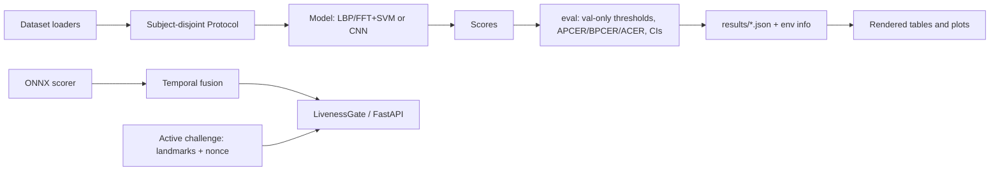

# liveness-detection

Face presentation-attack detection (print / screen replay) built around honest evaluation:
ISO/IEC 30107-3 metrics, subject-disjoint protocols, and cross-dataset generalization.

**Status: pipeline, metrics, classical baseline, CNN training path, active-challenge logic and serving layer are built and tested on a synthetic fixture. No real dataset has been used and no real-performance number exists yet. Real-data CNN evaluation remains blocked on dataset access.**

## Key results

Real-data results are pending licensed data. Synthetic smoke outputs are generated by the
commands below and are never presented as PAD performance. See [docs/RESULTS.md](docs/RESULTS.md).

## Why this exists

Most student anti-spoofing projects report intra-dataset numbers on random splits, which leak
subjects and hide the cross-dataset collapse. This repo fixes the protocol first and reports
the drop plainly.

## Quickstart

```bash
uv sync --extra train --group dev
uv run pytest
make lint typecheck
```

Tests run on a generated synthetic fixture, with no real data, network, or GPU needed.

## Usage

```bash
# synthetic smoke pipeline (labelled "not a real result")
PYTHONPATH=src uv run python bench/smoke_pipeline.py --out-dir /tmp/smoke
PYTHONPATH=src uv run python scripts/render_results.py --results-dir /tmp/smoke \
    --out /tmp/smoke/RESULTS.generated.md --plots-dir /tmp/smoke/plots

# CNN: 3 seeds, validation-ACER early stopping, resumable checkpoints
uv run python -m liveness.train --dataset synthetic --no-pretrained --epochs 2 \
    --seeds 0 1 2 --out-dir runs/cnn-smoke

# licensed data after creating manifest.csv as documented in DATA.md
uv run python -m liveness.train --dataset replay_attack \
    --data-root /data/replay-attack --target-dataset casia_fasd \
    --target-data-root /data/casia-fasd --seeds 0 1 2

# serve an ONNX model (contract: input "input" [N,3,H,W], output "logit" [N,1])
LIVENESS_API_MODEL_PATH=model.onnx LIVENESS_API_DECISION_THRESHOLD=0.5 \
LIVENESS_API_CLIP_ACCEPT_THRESHOLD=0.6 LIVENESS_API_CLIP_REJECT_THRESHOLD=0.4 \
uv run uvicorn --factory liveness.api.app:create_app
```

Endpoints: `GET /healthz`, `GET /v1/model`, `POST /v1/score`, `POST /v1/decide`. Every response
carries `score`, `decision`, `reason_code`, `model_version`. Unusable input yields
`INSUFFICIENT_QUALITY`, never `SPOOF`.

## Architecture



## Design

Protocols: [docs/PROTOCOLS.md](docs/PROTOCOLS.md). Decisions: [docs/DESIGN.md](docs/DESIGN.md).

## Data and licensing

Real datasets are research / non-commercial and are **never** committed or redistributed
([DATA.md](DATA.md)). Code is MIT. **Trained weights will not be published** because they derive
from non-commercial data.

## Limitations

See [docs/LIMITATIONS.md](docs/LIMITATIONS.md). 3D masks and injection attacks are out of scope.

## Roadmap

Done in code and synthetic verification: M0 protocols; M1 classical baseline; M2 CNN training
with balanced sampling, shortcut-resistant augmentation, validation-ACER early stopping,
three-seed aggregation, margin ablations, AMP safeguards and deterministic resume; M3 intra-
and cross-dataset evaluation; M4 active challenge; M5 fusion; M6 serving/export/quantization;
M7 documentation and threat model.

Externally blocked: the owner must obtain Replay-Attack and CASIA-FASD under their agreements,
and must record the demo GIF with their own face/device. Real metrics, failure grids and model
latency are intentionally not fabricated. Install CNN dependencies with
`uv sync --extra train --group dev`.
